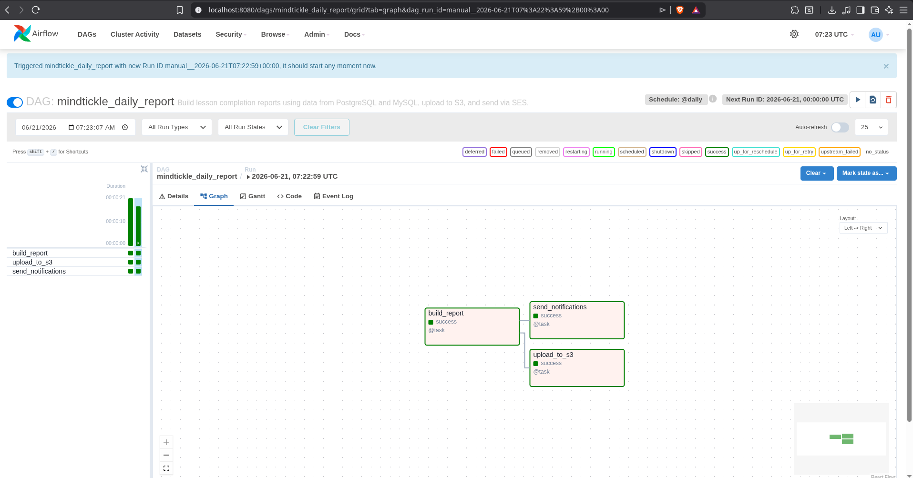
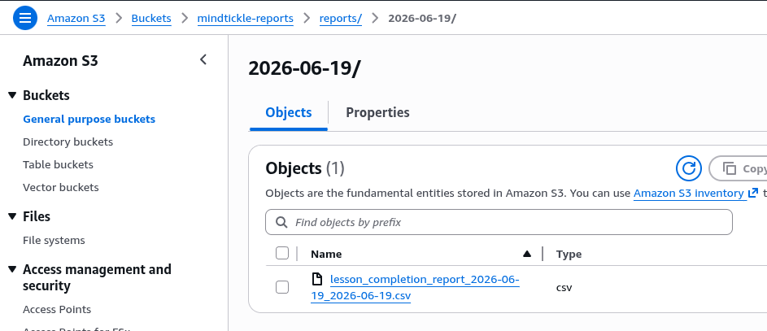

# Mindtickle Lesson Completion Report Generator

## 📋 Overview

This project automates the process of generating lesson completion reports for Mindtickle clients. It combines active user data from PostgreSQL with lesson completion records from MySQL, deduplicates entries, aggregates completions by user and date, and delivers the results via email with S3 backup storage.

## ✨ Key Features

- **Multi-source Data Aggregation**: Seamlessly combines data from PostgreSQL and MySQL databases
- **Deduplication**: Handles duplicate completion records intelligently using `completion_id`
- **Daily Scheduling**: Automatically processes yesterday's data on a daily schedule
- **On-demand Reporting**: Support for ad-hoc date range queries via DAG parameters
- **Cloud Storage**: Automatic upload to AWS S3 with configurable bucket settings
- **Email Distribution**: Direct report delivery via AWS SES with CSV attachment
- **Error Resilience**: Built-in retry logic and comprehensive error handling
- **Production-Ready**: Containerized with Docker for consistent deployment
- **Modular Design**: Clean separation of concerns across helper modules

## 🏗️ Architecture

### System Components

```
┌─────────────────────────────────────────────────────────┐
│                    Airflow Scheduler                     │
└──────────┬────────────────────────────────────────────────┘
           │
           ├─── PostgreSQL (Active Users) ──────────┐
           │                                        ├──→ build_report Task
           └─── MySQL (Completions) ────────────────┘
                                                      │
                                                 Aggregation
                                                      │
                                                      ↓
                                          CSV Report Generation
                                                      │
                       ┌──────────────────────────────┼──────────────────────────────┐
                       │                              │                              │
                       ↓                              ↓                              ↓
              Local Reports Dir                     AWS S3                       AWS SES
             (/opt/airflow/reports)                (upload)                      (email)
```

### Technology Stack

- **Orchestration**: Apache Airflow 2.10.3
- **Data Processing**: Polars (high-performance data frames)
- **Databases**: PostgreSQL, MySQL
- **Cloud Services**: AWS S3, AWS SES
- **Containerization**: Docker, Docker Compose
- **Language**: Python 3.x

## 📊 Data Flow

### Scheduled Execution (Daily)

1. **Trigger**: DAG automatically runs daily (00:00 UTC)
2. **Fetch Active Users**: Query PostgreSQL for active users
3. **Fetch Completions**: Query MySQL for lesson completions from the previous day
4. **Deduplicate**: Remove duplicate entries using `completion_id`
5. **Aggregate**: Group completions by user and date, counting lessons per user per day
6. **Generate CSV**: Create report with columns: `Name`, `Number of lessons completed`, `Date`
7. **Save Locally**: Store the report in the fixed container directory `/opt/airflow/reports`
8. **Upload**: Push report to S3 bucket
9. **Email**: Send report as attachment via SES

### Ad-hoc Execution (Manual)

Trigger the DAG via Airflow UI with parameters:
```json
{
  "start_date": "2026-06-01",
  "end_date": "2026-06-15"
}
```

This generates a report for the inclusive date range without automatic scheduling.

## 🎯 Design Choices

### 1. **Polars for Data Processing**
- Significantly faster than Pandas for large datasets
- Memory-efficient handling of multi-source joins
- Cleaner syntax for complex aggregations

### 2. **Deduplication Strategy**
- Uses `completion_id` as primary key to identify duplicate records
- Handles edge cases like multiple lessons per user per day
- Prevents inflated metrics in reports

### 3. **Environment Configuration**
- Sensitive credentials are stored in `.env` and read via environment variables (e.g. `MT_POSTGRES_HOST`) rather than hardcoded into the codebase. The report output directory is fixed at `/opt/airflow/reports` inside the container and is not configurable.
- `.env` is never committed to version control
- Supports both local and containerized deployments without code changes — only `.env` differs between environments

### 4. **Error Handling & Retry Logic**
- Automatic retry on failures (1 retry with 5-minute delay)
- Email notifications on task failures
- Comprehensive error messages for debugging

### 5. **Modular Helper Structure**
- `config.py`: Environment management and database connections
- `database.py`: Data fetching and aggregation logic
- `report.py`: CSV generation
- `storage.py`: S3 upload operations
- `notifications.py`: SES email delivery

## 🚀 Quick Start

> ⚠️ **IMPORTANT**: Before proceeding, review the [Configuration](#️-configuration) section to understand all required environment variables in `.env`.

### Prerequisites

- Docker Desktop installed and running ([Install Docker](https://docs.docker.com/desktop/))
- Docker Compose ([Install Docker Compose](https://docs.docker.com/compose/install/))
- AWS credentials for S3 and SES

### Setup & Launch

1. **Clone the repository and navigate into it:**
  ```bash
  git clone <repository-url>
  cd <repository-folder-name>
  ```
  Use whatever local folder name git checks the repo out into — there is no required fixed path.

2. **Create environment configuration:**
  ```bash
  cp .env.example .env
  cp ./setup/.env.example ./setup/.env
  ```

3. **Configure environment variables:**
  Edit `.env` with your configuration:
  - Database credentials and names
  - AWS region and credentials for S3 and SES
  - Airflow admin credentials

4. **Start all services:**

  Startup Script(recommended):
  ```bash
  chmod +x scripts/startup.sh
  ./scripts/startup.sh
  ```
  Manual:
  ```bash
  docker compose -f docker-compose.airflow.yaml up --build
  ```

5. **Access Airflow UI:**
  - Navigate to `http://localhost:8080` (or whichever host port you've mapped to the webserver in `docker-compose.airflow.yaml`, if you've changed it from the default)
  - Use the admin credentials from your `.env` file:
    - Username: `AIRFLOW_ADMIN_USER`
    - Password: `AIRFLOW_ADMIN_PASSWORD`

6. **Trigger the DAG:**
  - Find `mindtickle_daily_report` in the DAG list
  - Click the play button or navigate to trigger with custom parameters
  - For custom date range, use the JSON parameter editor:
    ```json
    {
     "start_date": "2026-06-01",
     "end_date": "2026-06-15"
    }
    ```

7. **Verify outputs:**
  - Check generated reports inside the container at the fixed path `/opt/airflow/reports` — e.g. `docker compose -f docker-compose.airflow.yaml exec airflow-webserver ls /opt/airflow/reports`
  - Monitor the S3 bucket for uploaded reports
  - Verify email delivery in SES sent items
  - Check the recipient inbox's spam/junk folder if the report does not appear in the main inbox

## 📂 Repository Structure

```
.
├── airflow/
│   ├── dags/
│   │   ├── mindtickle_daily_report.py      # Main DAG definition
│   │   └── helpers/
│   │       ├── __init__.py                 # Module exports
│   │       ├── config.py                   # Env & DB configuration
│   │       ├── database.py                 # Data fetching & aggregation
│   │       ├── report.py                   # CSV generation
│   │       ├── storage.py                  # S3 operations
│   │       └── notifications.py            # SES email delivery
│   └── plugins/                            # Airflow plugins directory
├── setup/
│   ├── docker-compose.yaml                 # Database services
│   ├── Dockerfile-MySQL                    # MySQL image
│   ├── Dockerfile-PG                       # PostgreSQL image
│   ├── init.mysql.sql                      # MySQL sample data
│   └── init.pg.sql                         # PostgreSQL sample data
├── docker-compose.airflow.yaml             # Airflow + DB orchestration
├── Dockerfile-airflow                      # Airflow image
├── requirements.txt                        # Python dependencies
├── problem.md                              # Assignment requirements
├── README.md                               # This file
└── .env.example                            # Configuration template
```

## ⚙️ Configuration

### Environment Variables (`.env`)

**Airflow Runtime Configuration:**
```
AIRFLOW_UID=50000
AIRFLOW_GID=50000
AIRFLOW__CORE__EXECUTOR=SequentialExecutor
AIRFLOW__CORE__LOAD_EXAMPLES=False
AIRFLOW__WEBSERVER__WORKERS=2
```

**Database Configuration:**
```
MT_POSTGRES_HOST=<postgres-host>
MT_POSTGRES_PORT=5432
POSTGRES_DB=<postgres-database>
POSTGRES_USER=<postgres-user>
POSTGRES_PASSWORD=<postgres-password>

MT_MYSQL_HOST=<mysql-host>
MT_MYSQL_PORT=3306
MYSQL_DATABASE=<mysql-database>
MYSQL_USER=<mysql-user>
MYSQL_ROOT_PASSWORD=<mysql-password>
```
> Use the Docker Compose service names (e.g. `mt-postgres`, `mt-mysql`) for the host values when running via `docker compose up`. Only use `localhost` if you're running the DAG code directly on your host machine against locally exposed database ports.

**Airflow Admin Credentials:**
```
AIRFLOW_ADMIN_USER=<admin-user>
AIRFLOW_ADMIN_PASSWORD=<admin-password>
AIRFLOW_ADMIN_FIRSTNAME=<admin-firstname>
AIRFLOW_ADMIN_LASTNAME=<admin-lastname>
AIRFLOW_ADMIN_EMAIL=<admin-email>
```

**AWS S3 Configuration:**
```
AWS_REGION=<aws-region>
AWS_ACCESS_KEY_ID=<aws-access-key>
AWS_SECRET_ACCESS_KEY=<aws-secret-key>
S3_REPORT_BUCKET=<s3-bucket-name>
S3_REPORT_PREFIX=<s3-prefix>      # Optional, defaults to 'reports'
```

**AWS SES Configuration:**
```
SES_SENDER=<sender-email>
SES_RECIPIENTS=<recipient1@example.com,recipient2@example.com>
SES_SUBJECT=<email-subject>        # Optional, defaults to 'Lesson Completion Report'
```

## 📝 Usage Examples

### Example 1: Scheduled Daily Report

The DAG automatically runs every day at midnight UTC and processes the previous day's lesson completions.

### Example 2: Generate Report for Custom Date Range

1. Open Airflow UI → Trigger DAG
2. Enter parameters to match sample data (2026-06-18 to 2026-06-20):
   ```json
   {
     "start_date": "2026-06-18",
     "end_date": "2026-06-20"
   }
   ```
3. Click "Trigger"
4. Report file: `lesson_completion_report_2026-06-18_2026-06-20.csv`

### Example 3: Generate Single-Day Historical Report

Parameters:
```json
{
  "start_date": "2026-06-19",
  "end_date": "2026-06-19"
}
```

> **Note**: The examples above use 2026 dates to match the sample data, but **any date range in YYYY-MM-DD format is supported**. The DAG will process whatever data exists in the databases for your specified date range.

## 📊 Report Output Format

**CSV Columns:**
- `Name`: User's full name
- `Number of lessons completed`: Count of unique lessons completed
- `Date`: Report date (YYYY-MM-DD format)

**Example:**
```csv
Name,Number of lessons completed,Date
John Doe,5,2026-06-20
Jane Smith,3,2026-06-20
Bob Johnson,7,2026-06-20
```

**Filename Pattern:**
```
lesson_completion_report_{start_date}_{end_date}.csv
```

**Storage Locations:**

- **Local (inside the container)**: `/opt/airflow/reports/lesson_completion_report_{start_date}_{end_date}.csv`
- **S3**: `s3://{S3_REPORT_BUCKET}/{S3_REPORT_PREFIX}/{date_subfolder}/{filename}`
  - Example: `s3://mindtickle-reports/reports/2026-06-20/lesson_completion_report_2026-06-20_2026-06-20.csv`
  - `S3_REPORT_PREFIX`: User-defined prefix (e.g., "reports", "daily", etc.)
  - Date subfolder: Automatically generated based on report generation date (YYYY-MM-DD format)

**Local persistence and host access**

- Reports are stored in a Docker named volume so they persist across container restarts. The compose setup uses the volume named `airflow_reports` which is mounted at `/opt/airflow/reports` inside the `airflow` container.
- Note: a custom host mount point is avoided for now because mounting host folders into the container can create file permission and ownership issues between the host user and the `airflow` user.
- To view or retrieve reports from the host, list and inspect the volume:

```bash
docker volume ls
docker volume inspect airflow_reports
# on Linux hosts the Mountpoint in the inspect output points to the folder containing files
ls "$(docker volume inspect --format '{{ .Mountpoint }}' airflow_reports)"
```

- Alternatively run a temporary container that mounts the volume to read files (works cross-platform):

```bash
docker run --rm -v airflow_reports:/data alpine ls -la /data
docker run --rm -v airflow_reports:/data alpine cat /data/lesson_completion_report_2026-06-20_2026-06-20.csv
```

## � Screenshots

### Airflow DAG Execution



### S3 Report Storage

Screenshots demonstrating S3 bucket organization and uploaded reports:



### Email Report Delivery

Screenshots showing the email delivery via AWS SES:


## 📦 Dependencies

All dependencies are managed via `requirements.txt` and automatically installed in the Docker image:

```
apache-airflow==2.10.3
apache-airflow-providers-amazon
apache-airflow-providers-mysql
apache-airflow-providers-postgres
mysql-connector-python
psycopg2-binary
boto3
polars

```

## ✅ Tests

Unit tests are provided under the `tests/` directory. They cover the configuration helpers, S3 storage helper, and SES notification helper using small, fast mocks so they can run locally without AWS or Airflow services.

Recommended: use a Python virtual environment to ensure the interpreter and installed packages are isolated and consistent.

Create and use a venv, then run tests:

```bash
cd <repository-folder-name>
python -m venv .venv
source .venv/bin/activate
pip install -r requirements.txt
pytest -q
```

Alternatively run tests inside the Airflow container (if you prefer the container's interpreter). Two useful commands that build the Airflow image and run tests against the mounted workspace:

```bash
docker compose -f docker-compose.airflow.yaml build --no-cache airflow
docker compose -f docker-compose.airflow.yaml run --rm \
  -v "$(pwd)":/opt/airflow/workspace \
  airflow bash -c "pip install --no-cache-dir -r /tmp/requirements.txt || true && pytest -q /opt/airflow/workspace/tests"
